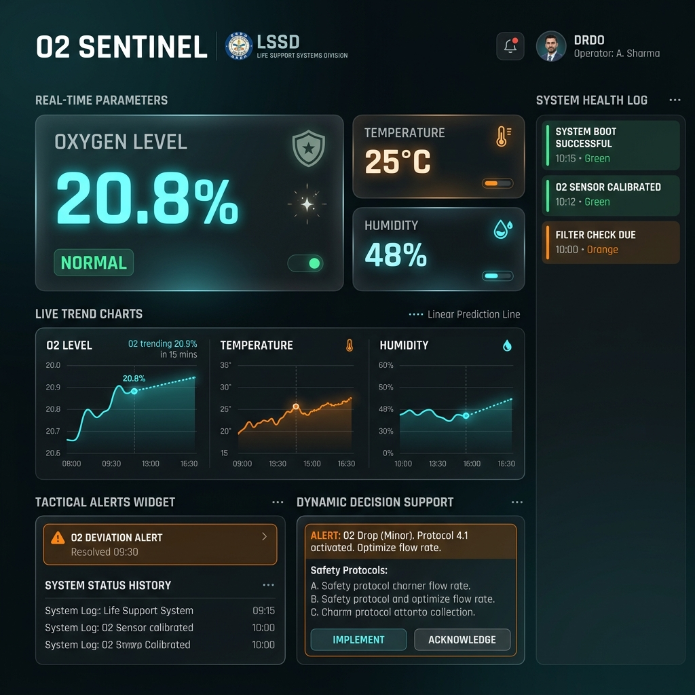
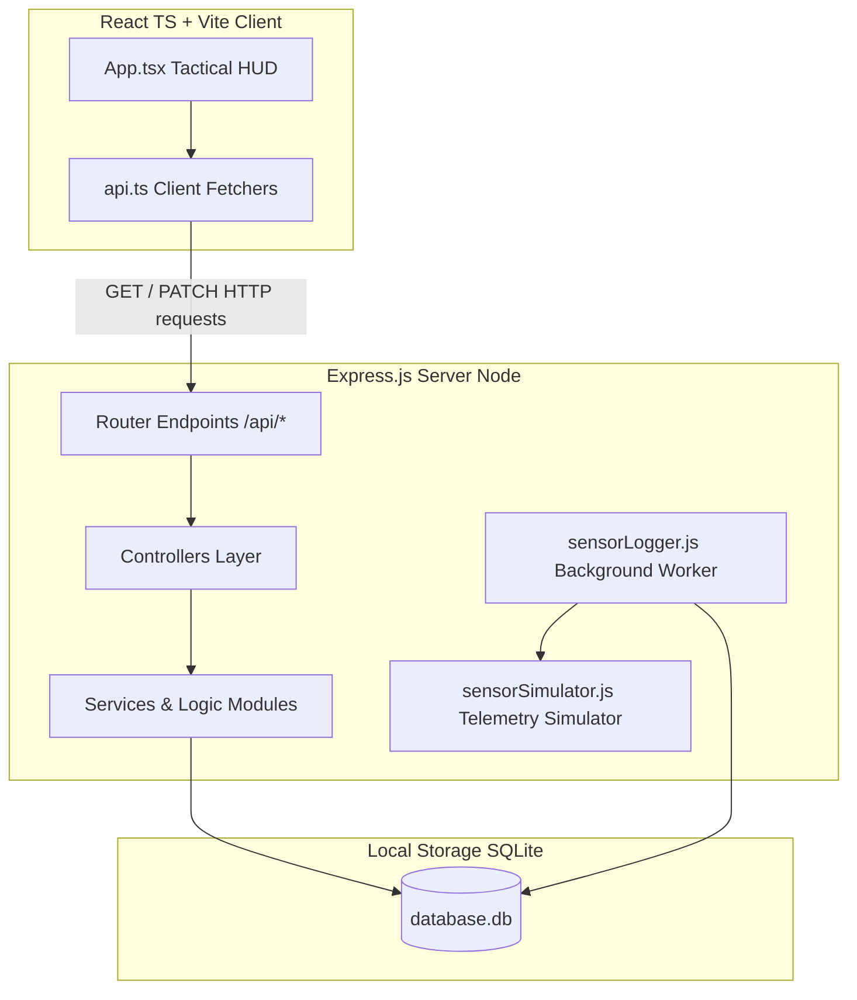

# 🛡️ O₂ Sentinel – DRDO DEBEL LSSD Environmental Monitoring Dashboard

O₂ Sentinel is an advanced, production-grade environmental telemetry monitoring system and tactical dashboard designed for the **Life Support Systems Division (LSSD)** at the **Defence Bioengineering and Electromedical Laboratory (DEBEL) - DRDO, Government of India**. 

The system collects real-time chamber telemetry logs (Oxygen concentration, Temperature, and Humidity), runs an alert deduplication state machine, calculates dynamic trend forecasts using least-squares linear regression, and displays prioritized safety action recommendations to control room operators.

---

## 📸 Screenshots

### Tactical Control Room HUD
Below is the visual interface design of the **O₂ Sentinel** tactical dashboard, featuring glassmorphism cards, glowing status sweeps, real-time SVG charts, prediction projections, and active safety recommendations.



---

## 🗺️ System Architecture

The project conforms to a decoupled **Model-View-Controller (MVC)** architecture matching DRDO production guidelines:



---

## 🌟 Key Features

* **Tactical Control Room HUD:** A premium dashboard featuring glowing state indicators, custom SVG badges, status alert rings, and interactive SVG sweeps charts displaying the last 15 minutes of chamber telemetry.
* **Telemetry Drift & Anomaly Simulator:** Built-in simulation utility allows operators to inject real-time telemetry drifts to test emergency sirens, active safety recommenders, and database alerts.
* **Alert State Machine & Deduplication:** A backend engine that evaluates parameter limits, manages active alert lifecycles, deduplicates database entries, and auto-resolves alarms when parameters return to nominal limits.
* **Decision Support Recommendations:** A rule-based directive engine that serves actionable instructions based on chamber conditions categorized into three severity tiers (Nominal, Warning, and Critical).
* **Least-Squares Prediction Module:** Extrapolates depletion paths at $+30\text{m}$ and $+60\text{m}$ from the last 30 database records, plotting projections directly onto the dashboard charts.
* **Data Log CSV Streaming Exporter:** Utilizes HTTP chunked transfer-encoding to stream raw database records in RFC 4180 CSV tables to avoid server memory overload.
* **Database Performance Indexing:** Optimized query execution on SQLite databases using database indexes on `alerts(status, type)` and `sensor_logs(timestamp)`.
* **Consistent API JSON Envelopes:** Ensures standard and predictable JSON models for all client requests:
  * **Success:** `{ "success": true, "data": ... }`
  * **Error:** `{ "success": false, "error": "Error message" }`

---

## ⚙️ Tech Stack

* **Frontend:** React 18, TypeScript, Vite, SVG Charts, Vanilla CSS (Tactical Glow Theme)
* **Backend:** Node.js, Express.js
* **Database:** SQLite3, Node-SQLite driver
* **Simulation:** Async Background Log Loop (5-second intervals)

---

## 📂 Folder Structure

```text
o2-sentinel-frontend/
├── backend/
│   ├── controllers/
│   │   ├── alertController.js          # Handles active alerts & acknowledgements
│   │   ├── recommendationController.js # Handles decision support data
│   │   ├── sensorController.js         # Handles telemetry logs & linear predictions
│   │   ├── statsController.js          # Computes accumulated min/max/average stats
│   │   └── systemController.js         # Evaluates process memory & SQLite file size
│   ├── database/
│   │   └── database.db                 # SQLite Persistent File
│   ├── models/
│   │   └── database.js                 # DB connection, schema migrations, and helpers
│   ├── routes/
│   │   ├── alertRoutes.js
│   │   ├── deviceRoutes.js
│   │   ├── recommendationRoutes.js
│   │   ├── sensorRoutes.js
│   │   ├── statsRoutes.js
│   │   └── systemRoutes.js
│   ├── services/
│   │   ├── alertEngine.js              # Evaluates alarm operational thresholds
│   │   ├── recommendationEngine.js     # Safety action rule parser
│   │   ├── sensorLogger.js             # Background interval logging daemon (5s)
│   │   └── sensorSimulator.js          # Chamber telemetry random-walk generator
│   ├── server.js                       # Express Bootstrapper
│   └── package.json
└── frontend/
    ├── src/
    │   ├── dashboard/
    │   │   └── components/
    │   │       ├── Loader.tsx          # Boot loader splash HUD
    │   │       ├── PredictionChart.tsx # SVG linear regression projection chart
    │   │       ├── StatusCard.tsx      # Core indicator card widgets
    │   │       └── TrendChart.tsx      # SVG telemetry sweep charts
    │   ├── services/
    │   │   └── api.ts                  # Fetch API helpers & JSON unwrapper
    │   ├── App.tsx                     # Main layout & polling hooks
    │   ├── index.css                   # Global tactical CSS variables & classes
    │   └── main.tsx
    ├── package.json
    └── vite.config.ts
```

---

## 🚀 Installation & Local Setup

### Prerequisites
* [Node.js](https://nodejs.org/) (v16.0.0 or higher)
* [npm](https://www.npmjs.com/) (v8.0.0 or higher)

### Setup Commands

1. **Clone the Repository:**
   ```bash
   git clone https://github.com/sheelakansha/o2-sentinel-frontend.git
   cd o2-sentinel-frontend
   ```

2. **Boot the Backend Server:**
   ```bash
   cd backend
   npm install
   npm run dev
   ```
   > [!NOTE]
   > The server automatically initializes the SQLite database file (`backend/database/database.db`), runs migrations, mounts indexes, starts the background logging daemon, and listens on `http://localhost:5000`.

3. **Boot the Frontend Dashboard Client:**
   ```bash
   cd ../frontend
   npm install
   npm run dev
   ```
   > [!NOTE]
   > The Vite developer client will start the interactive UI dashboard on `http://localhost:5173`.

---

## 📡 REST API Endpoints

The backend exposes a highly structured REST interface. All endpoints return responses enclosed in standard success/error JSON envelopes.

| Method | Endpoint | Description | Query Parameters / Payload |
| :--- | :--- | :--- | :--- |
| **GET** | `/api/sensors` | Fetch current real-time telemetry coordinates | None |
| **GET** | `/api/sensors/history` | Chronological telemetry log entries | `page` (int), `limit` (int) |
| **GET** | `/api/sensors/prediction` | Linear regression predicted slope values | None |
| **GET** | `/api/sensors/export` | Stream full sensor database logs as CSV | None |
| **GET** | `/api/alerts` | Fetch list of active alerts | None |
| **GET** | `/api/alerts/history` | Chronological alert history | `severity` (string), `status` (string), `page` (int) |
| **PATCH** | `/api/alerts/:id/acknowledge` | Acknowledge an active alarm breach | `id` (path parameter) |
| **GET** | `/api/alerts/export` | Stream full alerts database logs as CSV | None |
| **GET** | `/api/recommendations` | Fetch dynamic emergency recommendations | None |
| **GET** | `/api/stats` | Fetch accumulated min/max/avg coordinates | None |
| **GET** | `/api/system` | Verify server API status | None |
| **GET** | `/api/system/health` | Diagnostic CPU, Heap Memory, and database size | None |
| **GET** | `/api/system/events` | Audit log of startup, breaches, and ACK events | None |

---

## 📈 Future Scope

1. **Physical Hardware Relay Integration:** Map recommendation engine directives (such as `ACTIVATE_VENTILATION` relay signals) to hardware relay controller boards (e.g. Modbus/Arduino/Raspberry Pi) via physical serial lines or WebSockets.
2. **Exponential Decay Forecasting Model:** Integrate non-linear regression curves into the prediction module to model atmospheric pressure and gas depletion rates inside sealed chambers.
3. **Role-Based Access Control (RBAC):** Deploy JSON Web Token (JWT) credentials to lock simulation controls, alert acknowledgements, and data exports to authorized supervisors.
4. **WebSocket Telemetry Streaming:** Upgrade client polling loops to a stateful WebSocket connection, reducing database reads and network load on server processes.
